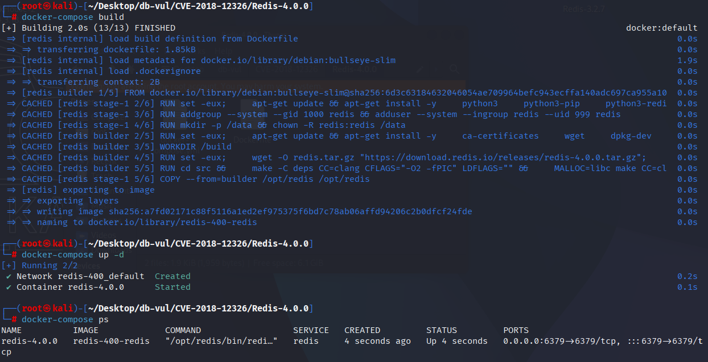
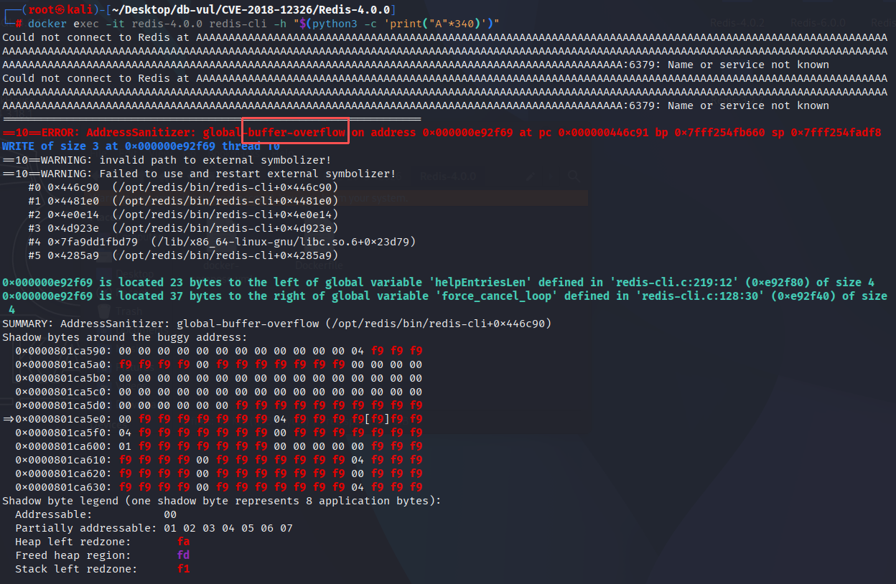

# CVE-2018-12326 CWE-119 Redis 缓冲区溢出

## 漏洞背景

- **Redis**：一个key-value 存储系统，是跨平台的非关系型数据库。开源的内存数据库，提供了一个高性能的键值（key-value）存储系统，常用于缓存、消息队列、会话存储等应用场景。客户端通过套接字与 Redis 服务器通信，发送命令，服务器更改其状态（即其内存结构）以响应此类命令。
- 

## 漏洞原理

redis-cli 在构造交互式提示符（prompt）时把主机名与端口等信息直接拼接到固定大小的全局缓冲区里，并错误地把 `anetFormatAddr/snprintf` 的返回值当作“实际写入长度”用于后续偏移与剩余空间计算。当传入超长主机名（如通过 -h 参数）导致输出被截断时，返回值可能大于缓冲区大小，从而使后续续写发生全局缓冲区越界

## 漏洞定位

分析 Redis-4.0.0 源码：

在 redis/src/redis-cli.c 文件，第 153 行`cliRefreshPrompt`函数

```c
// redis-cli.c 文件，第 153 行
static void cliRefreshPrompt(void) {
    int len;

    if (config.eval_ldb) return;
    if (config.hostsocket != NULL)
        len = snprintf(config.prompt,sizeof(config.prompt),"redis %s",
                       config.hostsocket);
    else
        len = anetFormatAddr(config.prompt, sizeof(config.prompt),
                           config.hostip, config.hostport);
    /* Add [dbnum] if needed */
    if (config.dbnum != 0)
        len += snprintf(config.prompt+len,sizeof(config.prompt)-len,"[%d]",
            config.dbnum);
    snprintf(config.prompt+len,sizeof(config.prompt)-len,"> ");
}
```

## 漏洞修复


```c
static void cliRefreshPrompt(void) {


    if (config.eval_ldb) return;

    sds prompt = sdsempty();
    if (config.hostsocket != NULL) {
        prompt = sdscatfmt(prompt,"redis %s",config.hostsocket);
    } else {
        char addr[256];
        anetFormatAddr(addr, sizeof(addr), config.hostip, config.hostport);
        prompt = sdscatlen(prompt,addr,strlen(addr));
    }

    /* Add [dbnum] if needed */
    if (config.dbnum != 0)
        prompt = sdscatfmt(prompt,"[%i]",config.dbnum);

    /* Copy the prompt in the static buffer. */
    prompt = sdscatlen(prompt,"> ",2);
    snprintf(config.prompt,sizeof(config.prompt),"%s",prompt);
    sdsfree(prompt);
}
```

## 影响范围

Reids：

-  x to 4.0.9
-  5.0 rc1 to rc2

## 环境搭建

启动 Docker 环境，Redis 版本为 4.0.0，在编译时开启了 ASan 内存检测工具

```txt
NIST:NVD    Base Score:8.4 HIGH    Vector:CVSS:3.1/AV:N/AC:L/PR:L/UI:N/S:U/C:H/I:H/A:H
```

```txt
cpe:2.3:a:redislabs:redis:4.0.0:*:*:*:*:*:*:*
```



## 漏洞复现

进入容器命令行，执行 PoC 命令，从 ASan 的关键信息中可以看到 `redis-cli` 客户端发生了缓冲区溢出

```bash
docker exec -it redis-4.0.0 redis-cli -h "$(python3 -c 'print("A"*340)')"
```



## PoC分析


## 参考链接

[NVD - CVE-2018-12326](https://nvd.nist.gov/vuln/detail/CVE-2018-12326#range-14718924)

[Security: fix redis-cli buffer overflow. · antirez/redis@9fdcc15](https://github.com/antirez/redis/commit/9fdcc15962f9ff4baebe6fdd947816f43f730d50)

[Redis CVE-2018-12326 分析](https://bestwing.me/redis-CVE-2018-12326-analysis.html)
